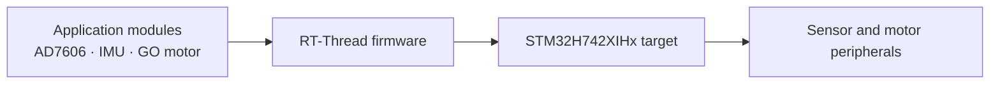

# RTTnew-experience

## Overview

An RT-Thread firmware workspace configured for the STM32H742XIHx target. The repository includes application code for AD7606, IMU, and GO motor integration, alongside the RT-Thread project configuration and supporting drivers.

## What It Does

- Provides application modules for the AD7606, IMU, and GO motor.
- The existing project notes report motor rotor-position and temperature readout, plus rotation control.
- The same notes record a 7% motor communication packet-loss result in the prior test context and an unresolved AD7606 SPI wait issue.

## Architecture / Workflow

The repository separates application modules, drivers, libraries, and RT-Thread components. The target and peripheral relationships below reflect the checked-in project structure and README notes.

## Build and Hardware Setup

Build toolchain, board wiring, and reproducible setup steps: **TODO** (not documented in the repository).

## Status

This is an engineering baseline with known integration work remaining. No benchmark beyond the result recorded in the original project notes is claimed.
